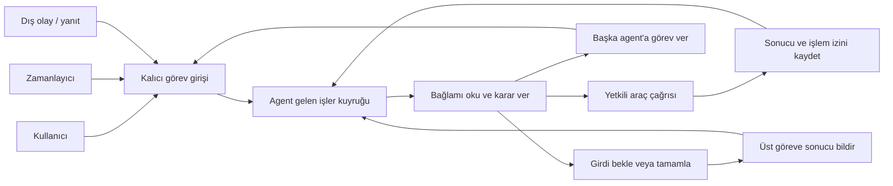

# Verda v2

Mac üzerinde çalışan, kalıcı görev kuyrukları olan agent çatısı. Mevcut GitHub Pages arayüzü korunur. Genel agent döngüsü çalışır; canlı emlak araştırması için kaynak adaptörleri ve mesaj politikası henüz tamamlanmamıştır.

Kod deposu: [tremo/verda](https://github.com/tremo/verda). Gerçek ilan verileri, satıcı yazışmaları, yerel raporlar ve erişim anahtarları bu depoya dahil değildir.

Bu sürüm:

- Eski SQLite verisini tek tutarlı, salt okunur işlemle alır; kaynak veritabanını değiştirmez.
- İlan, kontrol, görev, kapı, mesaj, kullanıcı notu ve olay geçmişini sürümlü bir gölge kopyada saklar.
- Aynı içerik tekrar aktarıldığında yeni kayıt üretmez; değişen kaynak ayrı sürüm oluşturur.
- Hazır mesajları ve eski görevleri çalıştırılabilir kuyruğa koymaz. Belirsiz teslimatı aynen korur.
- İlan dosyası ve sayfalanmış işlem geçmişini yerel API’den sunar.
- Yeni doğrulanmış gözlemler için 15 milyon TL, 1.000 m² ve 45 dk kurallarını hesaplar.
- Mevcut dashboard JSON’unu `schemaVersion: 2` sınırında doğrular; bilinmeyen alanları kaybetmeden saklar ve geri verir.
- Araştırma görevlerini bağımlılık sırasına göre kalıcı olarak kaydeder; kaynak kilidi, süreli görev sahipliği, yeniden deneme ve iptal uygular.
- Dokuz adımlı örnek araştırmayı sentetik verilerle baştan sona çalıştırır. Gerçek kaynak bağlantıları eksikse işi açık bir nedenle bekletir.
- Model gerektiren adımları agent bazında seçilen sağlayıcıya yönlendirir. İlk çalışan sağlayıcı Codex CLI’dir; kural hesapları ve kaynak adaptörleri model çağırmaz.

Dashboard adaptörü şimdilik **mevcut üretilmiş görünümü taşıma** katmanıdır. Yeni agent sonuçlarından tam dashboard üretimi, Firestore senkronizasyonu ve canlı yayın henüz uygulanmadı. `sourceUpdatedAt` güncelliğini yeniden kanıtladığı iddia edilmez. Aktarılan tarihçe de yeniden doğrulanmış kanıt sayılmaz.

## Yerel çalıştırma

```bash
python3 -m venv .venv
.venv/bin/pip install -e '.[test,postgres]'
.venv/bin/verda init
.venv/bin/verda import-legacy /absolute/path/to/datca-state-backup.sqlite
.venv/bin/verda serve
```

Bu çalışma sırasında doğrulanan bağımlılık sürümleri `requirements.lock` içindedir. Aynı ortamı kurmak için önce `.venv/bin/pip install -r requirements.lock`, ardından `.venv/bin/pip install --no-deps -e .` kullanılabilir.

Yerel adres `http://127.0.0.1:8765/health`. Veri API’leri `.local/api-token` dosyasındaki anahtarı `Authorization: Bearer ...` başlığında ister. Anahtar ve bütün yerel veriler Git dışında kalır. Sunucu dış ağa bağlanmaz; satıcı mesajı ve bulut yayını yapacak bir endpoint içermez. API yeni bir dashboard değildir.

### Agent merkezi: görev, agent ve araç ayrı kavramlardır

`http://127.0.0.1:8765/control` yeni agent merkezidir. Sunucunun `.local/viewer-link` dosyasına yazdığı tek kullanımlık bağlantıyı önce aynı Mac'in tarayıcısında açın. Bağlantı 10 dakika, yerel oturum dört saat geçerlidir. Sunucu yeniden başlatılınca yeni bağlantı gerekir. Bağlantıyı paylaşmayın. Panel oturumu agent yönergesi/açıklaması düzenlemeye ve sınırlı yönetici inceleme görevi oluşturmaya izin verir; bu uçlar aynı Origin ve oturuma özgü CSRF başlığı ister. Genel komut API’leri Bearer anahtarı ister ve browser Origin başlığını reddeder.

- **Agent:** Sorumluluk alanı, yönergesi, model profili, araç yetkileri, delegasyon hedefleri ve gelen işler kuyruğu olan yürütücü. Sürekli açık bir model konuşması değildir; kayıtlı bağlamla uyanır.
- **Görev:** Bir agent'a atanmış hedef; girdisi, önceliği, ilan ilişkisi, kaynağı ve durumu vardır. “Doğal sit kontrolü” bir görevdir.
- **Araç:** İş yapan fonksiyon, script, kaynak adaptörü veya MCP çağrısıdır. Sit durumunu öğrenme görevinde Sahibinden operatörü “Konuşma okuma” ve “Mesaj gönderme” araçlarını kullanır.
- **Tetikleyici:** Zaman, kullanıcı isteği, dış olay veya başka agent'ın delegasyonu; görev oluşturur. Kendisi agent değildir.
- **İlan:** Görevlerin üzerinde çalıştığı dosyadır. Aynı ilan birçok agent'a; bir agent aynı anda birçok ilanın sıradaki görevlerine bağlı olabilir.

Yeni merkezde dört başlangıç rolü vardır: ana yönetici, Sahibinden operatörü, parsel operatörü ve araştırma agent'ı. Roller Python enum'uyla sınırlandırılmaz. Yeni bir rol yapılandırmaya eklenebilir. Önceki yedi rolün kataloğu `/control/legacy-definitions`, sabit dokuz görevli örnek ve eski ilan geçmişi `/control/flows` altında tarihsel inceleme için kalır; bunlar yeni çalışma modelini temsil etmez.

**İlk sürümün sit kuralı:** Yönetici işi Sahibinden operatörüne verir. Operatör önce mevcut yazışmayı okur; açık bir yanıt yoksa “Taşınmazda doğal veya arkeolojik sit durumu var mı?” diye mesajla sorar. Satıcı genel sit sorusuna açıkça “yok” derse sit açısından yeterli kabul edilir; ek resmî sorgu beklenmez. Sonuç **“Satıcı beyanına göre sit yok”** olarak kaydedilir. Soru, yanıtın aynen metni, ilan/konuşma/mesaj referansı ve varsa mesaj tarihi korunur; bu kayıt resmî doğrulama sayılmaz. Yalnız bir sit türüne verilen yanıt diğer türe genellenmez. Cevap yoksa veya belirsizse durum bilinmiyor kalır; çelişkili yanıtlar yöneticinin değerlendirmesine gider. “Sit var” yanıtında yalnız belirtilen tür ve derece kaydedilir.

Bu kural yönetici, Sahibinden ve araştırma agent'larının sürümlü prompt'larında bulunur ve panelden görülebilir. Bağlantısız sit katmanı araçları varsayılan kayıttan çıkarıldı; ileride bir sorgu yöntemi bağlanırsa araç olarak eklenebilir. Mesaj adaptörü ve gönderim politikası henüz bağlı olmadığından bu değişiklik tek başına canlı mesaj gönderimini başlatmaz. Ortak kayıt servisi gelecekteki konuşma aracı çıktısını ve agent yorumunu ayrı saklar; eski kayıtların doğrulama etiketleri geriye dönük değiştirilmez.

Ana görünüm **Akış tuvali**dir. Büyük agent kartlarının içinde araç ikonları bulunur; agent ve zamanlayıcı kendi simgeleriyle ayrılır. Sahibinden operatöründeki **Browser** ikonuna tıklanınca yalnız o agent'ın yetkili olduğu görev türleri açılır: ilan arama, ilan ayrıntısı okuma, mesaj gönderme, yanıt okuma. İşleme tıklanınca gerekli girdiler ve bağlantı durumu görülür. Browser, bu işlemlerin paylaştığı yetkinlik/oturum grubudur; bir ikonun görünmesi oturumun bağlandığı anlamına gelmez. Python, script ve MCP araçları da gruplanır; bu gruplama çalışma yetkilerini genişletmez.

Ana harita zamanlayıcı→agent ve yönetici→operatör bağlarını gösterir. **Ayrıntılı araç ağı** aynı kayıtların bütün agent→araç→kaynak bağlantılarını açar. Bir aracı birden fazla agent kullanıyorsa bu görünümde tek araç düğümüne bağlanırlar. Agent düğümüne tıklanınca kalıcı prompt, model, araçlar, tetikleyiciler, görev devri yetkileri ve gelen işler sağ panelde açılır.

Zamanlayıcı düğümü kayıtlı saati (Europe/Istanbul), tekrar aralığını, etkin/pasif durumunu, hedef agent'a gönderilen görev metnini, girdiyi, önceliği ve oluşmuş görevleri gösterir. Sabit tekrar aralığı çalışma süresi değildir: mevcut çekirdekte toplam görev süresi sınırı yoktur; agent'ın karar turu ve tek model çağrısı sınırları ayrıca gösterilir. Doğrudan statik araç işi oluşturan tetikleyicide model çağrısı olmadığı belirtilir. Olay tetikleyicisi olay türünü ve gerçek girdi kaynağını gösterir.

**Çalışma izi** seçeneği aynı tuvalde seçilen izin görevlerini, gerçekleşmiş devirleri, araç çağrılarını ve kaydedilmiş sonuç dönüşlerini çizer. Görev ve çağrı düğümleri verilen girdiyi ve kaydedilmiş çıktıyı açar. Tanımlı bir yetki gerçekleşmiş işlem olarak gösterilmez. Yakınlaştırma, sığdırma, tuvali ve düğümleri sürükleme vardır; konumlar yalnız mevcut sayfa oturumundadır. Prompt ve görev açıklaması hem bu panelden hem Agent listesi sekmesinden düzenlenebilir. Bağlantı kurma/silme ve zamanlama düzenleme henüz yoktur; İlanlar ve eksikler sekmesinden yönetici incelemesi başlatılabilir.

Araç kartı yerel Python kodunu, scripti, MCP kaydını ve henüz bağlanmamış adaptörü ayırır; yapılandırılmış bir script/MCP bağlantısı doğrulanmış gibi gösterilmez. Browser oturumunun durumu, paylaşılan kaynak, istek aralığı ve yazma politikası da görünür. Eski agent listesi ve kayıt sekmeleri ayrıntılı liste görünümü olarak korunur.

Agent'ın gerçek yönergesi, model tercihi, delegasyon hedefleri, tetikleyicileri ve ilan bazında görev izi ayrı sekmelerde incelenebilir. Kuyruk bekleyen/çalışan ve tamamlanan işleri ayırır; her işin kaynağı, önceliği, girdisi, sonucu ve araç çağrıları görünür. Doğrudan statik araçla yürütülen görev “Model kullanmaz” olarak işaretlenir. Toplam sayaçlar bütün görevleri kapsar; listede son 200 görev, olaylarda son 1.000 kayıt sınırı ve kesilme uyarısı vardır.

Üst durum kartları panelin açık olmasıyla görev yürütücüsünün çalışmasını ayırır. Worker bildirimi işlenirken en fazla 600 saniye, boşta 15 saniye geçerlidir; normal kapanışta durdu olarak kaydedilir. Bu gösterge işletim sistemi süreç denetimi değildir; ani kapanış son bildirim süresi dolana kadar görünmeyebilir. “Yenile” kayıtları tekrar okur; bu sayfa worker başlatmaz. Varsayılan kayıtta ön eleme hesabı ve iki kayıt okuma aracı vardır; bağımsız script ve MCP aracı henüz eklenmemiştir.

### Yönerge düzenleme ve yöneticinin kayıt takibi

Agent kartındaki **Kalıcı yönerge / system prompt** ve **Görev açıklaması** alanları düzenlenebilir. Kaydetme sürümlü ve kalıcıdır; başka pencerede değişmiş eski sürümün üzerine yazılmaz. Yeni görevler son kaydedilen yönergeyi alır; mevcut görevlerin kendi yönerge kopyaları değişmez. Yerel değişiklikler `agent_revisions` tablosunda saklanır, GitHub’a yazılmaz. Ortak çalışma protokolü ve araç yetkileri bu editörden değişmez.

Ana yönetici hedefi, kriterleri, bütçeyi ve sonuçları takip eder. `records.audit` mevcut ilanları, yapılandırılmış kaynak alanlarındaki boşlukları, açık görevleri ve hataları gösterir. `records.listing` ilgili ilanın kaynak bulgularını, agent kararlarını ve eski kontrol/yazışma arşivini sayfalı okur. Eski kayıtlar boş sayılmaz; satıcı beyanını agent sonuçlarından ve mevcut yazışmalardan okumadan tekrar soru sorulmaz. Yeni ve eski kayıtlar birleştirilirken arşiv yeniden yazılmaz. Sentetik görevler gerçek arşive erişmez.

**İlanlar ve eksikler** sekmesinden kayıt ve akış açılabilir; **Yöneticiye incelet** düğmesi kayıtları okuyacak bir yönetici işi oluşturur. Aynı kapsamda açık inceleme varken ikinci görev üretilmez. Her inceleme en fazla bir operatör görevi verebilir; sınır veritabanında da uygulanır. Önceden elenmiş ilana bu düğmeyle yeniden görev verilmez. Geçici okuma hatalarını motor sınırlı tekrarlarla ele alır; yönetici yeni görevlerle bu sınırı aşmamalıdır. Erişim engeli, belirsiz işlem ve bağlı olmayan araçlar yeni sorgu döngüsü oluşturmaz.

### Mevcut Chrome oturumuyla ilk canlı arama

`sahibinden.search` ve `sahibinden.read_listing` araçları kalıcı **Codex tarayıcı kuyruğuna** bağlıdır. Model araç kararını verir; görev `waiting_browser` durumuna geçer ve izinli tarayıcı sürücüsü mevcut Chrome oturumuyla işlemi yapar. Dönen kaynak kaydı, araç sonucu ve bildirim aynı veritabanı işlemiyle yazılır. Sonuç görev üzerinden yöneticiye döner; tekrar gelen aynı makbuz ikinci kayıt oluşturmaz. Kaynak URL’si, ilan kimliği ve arama filtreleri kontrol edilir. İşlem sırasında bağlantı kaybolursa otomatik yeniden gezinilmez; belirsiz iş kaynağı durdurur.

Bu ilk sürücüyü **aktif Codex oturumu** yürütür. Verda worker’ı Chrome’u tek başına kontrol etmez; Codex tarayıcı sürücüsü yokken yeni browser işleri kuyrukta bekler. Oturum göstergesi 10 dakikalık geçerlilik taşır ve normal ayrılmada kapatılır. Cookie veya profil kopyalanmaz. Jev kurulmadı; başka bir sürücü aynı iş/makbuz sözleşmesine bağlanabilir. Mesaj gönderme ve konuşma okuma henüz bağlı değildir.

Sürücü sözleşmesi ve kullanımı: [docs/BROWSER-DRIVER.md](docs/BROWSER-DRIVER.md). İlk canlı arama 5 Ekim 2026’da mevcut Chrome üzerinde, Datça satılık arsa / en fazla 15 milyon TL / en az 1.000 m² filtreleriyle doğrulandı. İlk sonuç sayfası ortak kayda yazıldı; diğer sayfalar ve ilan ayrıntıları bu çalışmada açılmadı. Gerçek sonuçlar `.local` altında tutulur, bu depoya eklenmez.

### Ortak kayıt servisi, abonelikler ve hata yönetimi

Kayıt servisi aynı uygulamadaki statik Python kodudur. Agent SQL yazmaz. Başarılı araç çıktısı, araç makbuzu ve `observation.recorded` olayı aynı SQLite işleminde saklanır. Ham çıktı, çağrı/görev/agent kimliği, ilan ve çalışma izi, mod, kayıt zamanı ve içerik özeti korunur. Basit fiyat/alan/rakım/parsel alanları kaynak bildirimi olarak normalleştirilir; bağımsız doğrulanmış bilgi sayılmaz. Yeni bulgu eskisini ezmez.

**İşi isteyene cevap ve yöneticiye bildirim ayrı teslimlerdir.** Her olay-alıcı çifti tekildir. Üst görev varsa sonucu alır; üst görev başka bir agent'a aitse yönetici de kendi teslimini alır. Üst görev zaten yöneticiye aitse ikinci yönetici işi oluşmaz. Ek agent'lar filtreli aboneliklerle aynı olayları alabilir. Panel kalıcı olayların salt okunur görünümüdür; kendisi model tüketicisi değildir.

Varsayılan yönetici aboneliği rutin bulguları ve yeniden deneme bilgilerini gelen kutusunda **bilgi** olarak tutar; bu kayıtlar model çağrısı oluşturmaz. Görev tamamlanması veya müdahale gerektiren durum değerlendirme başlatır. Bir görevin ara bulguları sonuçla birlikte değerlendirilir. Aynı kaynağın engellediği işler tek kaynak olayı altında toplanır; yeni etkilenen işler ayrı yönetici değerlendirmesi açmaz. Bildirim değerlendirmesinin kendi sonucu tekrar değerlendirme başlatmaz; denetim kaydı olarak kalır. Aynı iz en fazla 100 görev içerir.

Teslim ve işlenme farklı alanlardır: `pending/delivered/blocked`, ardından `waiting/processing/processed/attention`. Bilgi teslimi `observed` olarak görünür. İşlemeye başlama, alıcının görevi sahiplenmesiyle; değerlendirme onayı görevin tamamlanmasıyla kaydedilir. Araç çıktısının kaydedilmesi veya kuyruğa teslim edilmesi değerlendirme tamamlandı anlamına gelmez. Bir karar turu başladıktan sonra yeni sonuç gelirse görülmemiş sonuç onaylanmaz; görev tamamlanmadan önce yeni bildirimle tekrar çalışır. Eski teslimlerde bulunmayan işleme zamanları uydurulmaz.

Abonelikler yerel CLI ile yönetilir:

```json
{
  "key": "research-results",
  "target_agent": "research",
  "event_types": ["task.complete"],
  "source_agents": ["sahibinden"],
  "mode": "synthetic",
  "wake": true,
  "enabled": true
}
```

`verda agency-subscription FILE` aynı anahtardaki aboneliği günceller. Türler: `observation.recorded`, `task.complete`, `task.blocked`, `task.uncertain`, `task.failed`, `task.cancelled`, `task.waiting_user`, `task.retry_scheduled`, `source.blocked`, `source.recovered`. Mod `local`, `synthetic` veya `both` olabilir. Filtre değişikliği yalnız sonraki olayları etkiler; mevcut teslimlerin hedefleri ve kimlikleri korunur. `--supervisor-agent KEY` varsayılan yönetici hedefini seçer; boş değer otomatik yönetici aboneliğini kapatır, açıkça kaydedilmiş abonelikleri silmez.

| Hata | Uygulanan davranış |
|---|---|
| Geçici okuma hatası | Adaptörün `TransientToolError`, `TimeoutError` veya `ConnectionError` bildirmesi gerekir. Toplam 3 deneme, en az 60 ve 300 saniye bekleme; kaynak aralığı/adaptör bekleme süresi daha uzunsa o uygulanır. Aynı karar, girdi ve işlem kimliği korunur. Her deneme ayrı makbuzdur. |
| Kalıcı/hangi tür olduğu bilinmeyen hata | Otomatik tekrar yapılmaz; görev engellenmiş sonuçla raporlanır. |
| Kaynak engeli | `ResourceBlocked` ilgili kaynağı durdurur. CAPTCHA, oturum kaybı, 403/429 gibi durumları canlı adaptörün doğru sınıflandırması gerekir. Henüz canlı adaptör yoktur. |
| Geçici bildirim teslim hatası | Alıcı başına toplam 3 deneme; 5 ve 30 saniye bekleme. Kaynak araç tekrar çağrılmaz. Eksik alıcı/yapılandırma hatası doğrudan incelemeye ayrılır. |
| Belirsiz dış yazma | Kaynak karantinaya alınır; gönderim otomatik tekrarlanmaz. Gerçek konuşma geçmişiyle doğrulama adaptörü henüz yoktur. |
| Kayıt deposu hatası | Yeni dış işlem başlamaz. Dış işlemden sonra kayıt başarısız olmuşsa başlamış çağrı korunur; sahiplik süresi dolunca belirsiz olarak durdurulur. |

`verda agency-records-retry DELIVERY_ID` nedeni giderilmiş teslimi yeniden beklemeye alır; kümülatif deneme sayısını silmez. `verda agency-source-resume INCIDENT_ID --note "Erişim nasıl düzeltildi"` açık kaynak olayını kapatır ve aynı tanımla bekleyen okuma işlerini kaynak hız sınırına tabi olarak devam ettirir. Aktif veya sonucu belirsiz çağrı varsa bu komut reddedilir. Bu işlem kullanıcıya ait yerel yönetim komutudur; modelin aracı değildir. Canlı mesaj gönderimi mevcut politika kapısından halen geçemez.

`/control/private/health` kuyruktan bağımsız olarak depoya erişimi ve yazma kilidini kontrol eder. Worker kayıt hatasını ayrıca veritabanının yanındaki özel `.health/` dizinine yazar. Panel bu kontrolü görünürken 15 saniyede bir okur; sunucuya erişemiyorsa gösterilen verinin eski olabileceğini belirtir. Kontrol gelecekteki her disk yazmasının başarılı olacağını garanti etmez. Mac kapalıyken dışarıdan izleyen bir bulut servisi yoktur.

**Bildirimler ve hatalar** sekmesinde abonelik filtreleri, alıcıların ayrı teslim/işleme zamanları, sonraki denemeler ve kaynak olayından etkilenen işler görünür. Agent denetleyicisinde abonelikler ve haritada kayıt servisi bağlantıları vardır. Çalışma izindeki sonuç birden fazla alıcıya bağlanabilir. Büyük kanıtlar görev kapsamlı kayıt okumasıyla parçalar halinde alınır; bu işlem yalnız kendi veya teslim edilmiş kanıtlara erişir. Yöneticinin ayrıca verilmiş records.audit ve records.listing yetkileri aynı çalışma modundaki kayıtları araştırma amacıyla okuyabilir.

Şema v5 geçişi eski gözlem, sonuç, görev ve teslim kimliklerini korur. Eski sonuçlar için yeni alıcılar eklenmez ve geçmiş işler yeniden çalıştırılmaz. Önceki sürümde teslim edilmiş sonuçların işleme onayı `legacy` olarak belirtilir. Yükseltmeden önce veritabanı yedeği alınmalıdır.

Geçerli şema v6 ayrıca yerel yönerge sürümlerini, tarayıcı sürücü oturumlarını ve tarayıcı iş makbuzlarını saklar. Eski görev ve kaynak kayıtları korunur; yükseltme tarayıcı işi veya model çağrısı başlatmaz.

Bu katman kaynak bildirimlerini ve değerlendirmeleri saklar. Nihai kanıt kabulü, çelişki çözümü, ilan adaylığına bağlayıcı politika uygulanması, canlı browser/mesaj doğrulaması ve eski dashboard'a yayın ayrı tamamlanacak parçalardır.

## Ürün hedefi: n8n tarzı görsel otomasyon stüdyosu

Kullanıcının 5 Ekim 2026 yönlendirmesiyle ürünün ana yüzeyi **görsel akış editörü** olarak tanımlandı. Tuvalde düğümler eklenir, bağlanır ve ayarlanır; aynı tuval bir çalışma seçildiğinde yürütme izini gösterir. n8n burada etkileşim ve bileşen modeli için referanstır; n8n'i kurma veya mevcut uygulamayı ona taşıma kararı verilmiş değildir. Referans: [n8n kavramları](https://docs.n8n.io/key-concept-glossary.md), [akış oluşturma](https://docs.n8n.io/build-your-first-workflow.md).

**Bu bölüm hedef tasarımdır.** Mevcut agent merkezi bağlantı haritası ve çalışma izi gösteren bir inceleme tuvalidir. Aşağıdaki akış tanımlarını düzenleme/yayımlama, akış tanımı çalıştırıcısı ve düğüm ekleme/bağlama işlemleri henüz uygulanmadı. Agent kuyrukları, model döngüsü, araç kayıtları ve olay geçmişi bu katmanın altında kullanılacak mevcut çekirdektir.

### Görsel bileşenler

| Düğüm türü | İşlevi | Model gerekir mi? |
|---|---|---|
| Tetikleyici | Zaman, kullanıcı, webhook veya olayla akış başlatır | Hayır |
| Agent'a görev ver | Kayıtlı agent'ın kuyruğuna hedef ve girdi gönderir; sonucu bekleyebilir veya görev kimliğini hemen döndürebilir | Göreve göre |
| Araç / MCP | Yetkili bir aracı açık girdilerle çağırır | Hayır |
| Script / hesap | Kayıtlı kodu çalıştırır | Hayır |
| Koşul / filtre | Veriyi kurallarla dallara ayırır | Hayır |
| Her kayıt için / birleştir | İlanları tek tek işler, paralel sonuçları toplar | Hayır |
| Bekle / kullanıcı girdisi | Yanıt, süre veya insan kararı gelene kadar kalıcı olarak duraklar | Hayır |
| Alt akış | Yeniden kullanılabilir bir akışı çağırır | İçeriğine göre |
| Kaydet / bildir | Doğrulanmış sonucu veri katmanına yazar veya tanımlı bildirimi üretir | Hayır |

Agent kutusu yeni bir agent kopyası oluşturmaz; kayıtlı agent kimliğine referanstır. Sabah taraması, ilan detayı toplama ve yönetici mesajları üç ayrı akış olsa da hepsi aynı Sahibinden operatörünün kuyruğuna bağlanır. Aynı tarayıcı ve hesap için hız sınırı bütün akışlarda ortaktır. Araç, akıştan doğrudan çağrılsa da aynı yetki ve kaynak kontrollerinden geçer.

Akış bağlantısı **veri/çalışma sırasını**, agent'ın araç bağlantısı ise **kullanma yetkisini** ifade eder. Editör bunları farklı gösterir. Bir aracı agent'a bağlamak her görevde otomatik çağrılacağı anlamına gelmez. Agent'ın çalışma sırasında seçtiği araç ve delegasyonlar yürütme görünümünde açılır; tasarım tuvaline sabit adımlar gibi eklenmez.

### İki görünüm, aynı akış

- **Tasarım:** Solda düğüm kataloğu, ortada tuval, sağda seçili düğümün ayarları. Agent düğümünde seçilen agent, hedef, girdi eşlemesi ve bekleme davranışı bulunur. Agent'ın ortak prompt/model/araç ayarlarına ayrıca gidilir.
- **Çalıştırma:** Seçilen çalışmanın gerçek düğüm durumları, giriş/çıkış verileri, süreler, hata ve bekleme nedenleri aynı tuvale bindirilir. Agent adımı açılınca kararlar, araç çağrıları ve alt görevler görünür.

Bir ilan birden çok akıştan geçmiş olabilir. İlan dosyası hepsini tek zaman çizelgesinde toplar; buradan ilgili akış çalışmasına ve düğüme geçilir. Tasarım ile çalışmış geçmiş birbirine karıştırılmaz.

### Kalıcı akış sözleşmesi

Görsel editörün kaynak kaydı sürümlü bir `FlowDefinition` olacak: düğümler, düğüm türü ve sürümü, ayarlar, tipli giriş/çıkışlar, veri eşlemeleri, bağlantılar ve tuval konumları. UI çizimi bu kaydı düzenleyecek. Bağlantı bilgilerinin kendisi tanımda tutulmaz; yetkili yerel bağlantı kayıtlarına referans verilir.

Her çalıştırma bir `FlowRun` oluşturur ve yayımlanmış tanım sürümünü sabitler. Düğüm denemeleri `NodeRun` olarak kaydedilir. Agent düğümü mevcut gelen işler kuyruğunda bir görev açar; `flow_run_id`, `node_run_id`, `task_id`, `tool_call_id` ve `listing_ref` birlikte izlenir. Sonuç, ilgili bekleyen düğümü uyandırır. Worker veya tarayıcı oturumu bekleme boyunca açık tutulmak zorunda değildir.

Taslak düzenleme çalışan akışı değiştirmez. Test çalışması ile etkin zamanlanmış çalışma ayrı tutulur. Yerel kaydedilmiş örnek çıktı üzerinden düğüm testi yapılabilmesi, Sahibinden'e geliştirme sırasında gereksiz tekrar isteklerini azaltır. Tek düğümü yeniden çalıştırma, mesaj gibi dış etkileri körlemesine tekrarlamaz; kayıtlı teslimat durumunu kontrol eder.

### İlk uçtan uca editör kabulü

İlk dikey parça: **Elle başlat → agent'a görev ver → sonucu kaydet** akışını tuvalden oluştur, kaydet, yeniden aç ve sentetik araçlarla gerçek model döngüsünde çalıştır. Aynı agent'ı ikinci akıştan çağırıp ortak kuyruğu göster. Bir düğüm seçildiğinde o çalışmanın gerçek girdisini, araç çağrısını ve sonucunu göster. Sonraki düğüm türleri bu kayıt/çalıştırma sözleşmesine eklenir; her yeni düğüm için uygulama baştan yazılmaz.

Mevcut GitHub Pages ilan dashboard'ı korunur. Bu editör ayrı yerel yönetim yüzeyidir. Datça araştırması onun ilk uygulamasıdır; agent ve araç ekleyebilme temel ürün özelliğidir.

## Agent çatısının mimarisi



**Sahibinden örneği:** Sabah zamanlayıcısı tarama işini operatörün kuyruğuna verir. Yeni bulunan ilanlar için detay okuma işleri aynı operatöre gelir. Yönetici de farklı ilanlara ait konuşma veya mesaj görevleri atayabilir. Kuyruk öncelik, ardından geliş sırasını kullanır. Agent başına bir karar turu, kaynak başına bir araç çağrısı aynı anda çalışabilir. Bir kaynak beklemesi agent'ın diğer uygun işlerine geçebilmesine izin verir. Kritik bir gönderim başladıktan sonra başka bir iş için ortasında kesilmez.

Yönetici sabit DAG oluşturmak zorunda değildir. Görev bağlamı, önceki araç sonuçları ve dönen alt görevlerle karar verir: araç kullan, devret, kullanıcı girdisi bekle veya tamamla. Yönetici `delegate` ile sonucu bekleyebilir veya `dispatch` ile beklemeden birden fazla görevi kuyruğa bırakabilir. Tamamlanmamış alt işler varken üst görev tamamlanamaz. Alt işler tamamlandığında üst görev tekrar kuyruğa alınır; alt görevde engel oluşursa yönetici yeniden karar vermek için uyandırılır. Bekleyen üst görev worker veya model oturumu tutmaz. Bir görev başka agent'a devredilirken girdi kopyası, üst/alt görev bağı ve ortak iz kimliği saklanır. Bir iz en fazla 100 görev; her agent görevi yapılandırılmış tur bütçesiyle sınırlıdır.

Görevlerin sonucu doğrudan resmî kanıt veya uygunluk kararı sayılmaz. Alan uygulamasında belge/konum doğrulaması ve kanıt kabulü ayrıca araçlarla uygulanmalıdır. Genel çatı araştırma sırasını bilmez; bu kurallar görev yönergeleri, araç sözleşmeleri ve alan doğrulayıcılarına aittir.

### Çalışan çekirdek

Yeni durum `.local/agency.sqlite` dosyasındadır. Eski arşiv ve önceki workflow veritabanları aynen korunur. `agency-init` tekrar çalıştırılabilir; şema v1→v2→v3 yükseltmesi işlemseldir. v3 görev yürütücüsü durum bildirimlerini ekler. Yedeklerde üç veritabanı da bulunmalıdır.

- Kalıcı gelen işler kuyruğu, öncelik, atomik sahiplenme, agent başına tek karar turu.
- Agent bazında sağlayıcı/model, sürümlü yönerge ve araç/delegasyon izinleri. Görev oluşurken tanımın kopyası ve yapılandırma özeti saklanır; çalışırken yapılandırma değişmişse sessizce farklı yetkiyle devam etmez.
- Codex ile gerçek karar döngüsü, dinamik görev devri, alt görev sonucuyla yöneticinin yeniden uyanması.
- Python, sabit komutlu script ve MCP araç kaydı. MCP stdio bağlantısı yerel test sunucusuyla doğrulandı; HTTP transport kod yolu mevcut, dış servis kimlik doğrulaması henüz eklenmedi.
- Statik görevlerde `executor_tool` doğrudan belirtilir; agent'ın kuyruğu ve araç izinleri kullanılır, **model çağrısı yapılmaz**.
- Kaynak kilidi ve araç çağrıları arasında kalıcı minimum süre. Kaynak durdurma sinyali alan adaptör `ResourceBlocked` üretir; bağlı kuyruk durur. Gerçek tarayıcıdan CAPTCHA/429/403/oturum kaybı tespiti henüz bağlı değildir.
- Zamanlayıcı teslimatı ve dış olay aboneliği; tekrar gelen istekler aynı anahtarla çoğaltılmaz. Kaçırılmış zaman aralıkları tek teslimata birleştirilir.
- Girdi bekleyen göreve cevap gelince devam etme. Araç çağrısı başlamışken worker kaybolursa belirsiz durum saklanır, kaynak durur; otomatik tekrar yapılmaz.
- İşlem açıklaması, araç girdisi/çıktısı, görev devri, model sağlayıcısı, çağrı kimliği, kullanım ve prompt sürümü olaylara yazılır. Bunlar modelin iç düşünce kaydı değildir.

### Başlatma ve görev verme

```bash
.venv/bin/verda agency-init
.venv/bin/verda agency-submit sahibinden "Atanan ilanın ayrıntısını oku" \
  --inputs .local/listing-input.json --listing-ref LISTING_ID --request-key read-LISTING_ID-v1

# Kuyruktan tek karar turu. Araç bağlı değilse açık nedenle bekler.
.venv/bin/verda agency-worker --max-steps 1

# Sürekli yerel worker ve zamanlayıcı teslimatı; terminalde Ctrl+C ile durdurulur.
.venv/bin/verda agency-worker --continuous

# Gerçek Codex; yalnız sentetik araçlar ve örnek ilan. Sabit görev planı yok.
.venv/bin/verda agency-demo
.venv/bin/verda agency-status
```

`agency-demo`, yöneticiye yalnız hedef verir. Yönetici operatöre devretmeyi, operatör araç çağrısını ve tamamlamayı, yönetici de sonucu nasıl özetleyeceğini modelle seçer. Sentetik araçlar ayrı kaynak adları kullanır ve canlı işleri tamamlamaz. 5 Ekim 2026 yerel doğrulamasında yönetici → Sahibinden operatörü → örnek ilan okuma aracı → operatör sonucu → yönetici sonucu zinciri **dört gerçek Codex çağrısıyla** tamamlandı. Bu Sahibinden bağlantısının çalıştığı anlamına gelmez.

Salt kodla çalışan görev örneği (`.local/screen.json` içeriği `{"price_tl": 8000000, "area_m2": 2000}`):

```bash
.venv/bin/verda agency-submit research "Fiyat ve alan ön elemesi" \
  --inputs .local/screen.json --tool policy.screen --request-key screening-example
.venv/bin/verda agency-worker --max-steps 2
```

API'den görev girişi `POST /api/agency/tasks`, olay girişi `POST /api/agency/events`, kullanıcı cevabı `POST /api/agency/tasks/{id}/reply` yollarındadır. İlk ikisi tekrar üretmeyi önlemek için istek anahtarı alır. Başka bir uygulama veya MCP sunucusu bu yetkili girişleri çağırabilir; Verda'nın kendi MCP **sunucusu** henüz yoktur. Verda'nın MCP **istemcisi** araç tüketmek için uygulanmıştır.

### Yeni agent, script veya MCP aracı ekleme

Başlangıç tanımları `src/verda/agency/default.json` dosyasındadır. Yerel kopyayı düzenleyip `--agency-config .local/agency.json` parametresini komuttan önce verin. Araç eklemek onu bütün agent'lara açmaz; ilgili agent'ın `tools` listesine de eklemek gerekir. Modelin yazdığı komut veya sunucu adresi çalıştırılmaz; bunlar yalnız güvenilen yerel yapılandırmadan gelir.

Bir agent kaydı `key`, `label`, `description`, `prompt`, `version`, `model`, `tools`, `delegates`, `max_turns` içerir. Model profili `provider`, `model`, `timeout_seconds` alanlarıdır. Yeni sağlayıcı aynı `ModelProvider.generate` arayüzüyle engine'e kaydedilir; başka firma adını yazmak adaptörü kendiliğinden kurmaz. Şu anda Codex uygulanmıştır.

Script araç kaydı örneği:

```json
{
  "key": "local.measure",
  "label": "Yerel ölçüm",
  "description": "Kayıtlı ölçümü hesaplar",
  "transport": "script",
  "command": ["/absolute/path/to/python", "/absolute/path/to/measure.py"],
  "input_schema": {"type": "object", "properties": {"value": {"type": "number"}}, "required": ["value"], "additionalProperties": false}
}
```

Script JSON girdisini stdin'den okur, JSON çıktısını stdout'a yazar. Shell açılmaz. Script sandbox'ı yoktur; yapılandırılan script güvenilen yerel kod olmalıdır. Python fonksiyonları `Registry(config, handlers={"tool.key": callable})` ile bağlanır.

MCP araç kaydında `transport: "mcp"`, `remote_name`, `server_url` **veya** stdio `command` tanımlanır. Girdi şeması ve agent yetkisi yerelde açıkça tanımlanır. Sunucunun sunduğu diğer araçlar veya yönergeler kendiliğinden içeri alınmaz. SDK: [resmî MCP istemci belgeleri](https://py.sdk.modelcontextprotocol.io/client/).

Zamanlayıcı JSON kaydı `key`, `kind: "timer"`, `next_at` (UTC Unix zamanı), `spec: {agent, objective, inputs, interval_seconds, priority}` içerir. Günlük kullanım için başlangıç zamanı açıkça hesaplanır ve aralık 86400 saniyedir; saat dilimli genel cron takvimi henüz yoktur. Olay kaydı `kind: "event"`, `spec.event_type` ve aynı görev hedefini içerir. Kayıt için `agency-trigger FILE`, dış olay teslimi için `agency-event EVENT_TYPE FILE --request-key KEY` kullanılır. Zamanlayıcı yalnız worker çalışırken teslim edilir; Mac kapalıyken bulut yürütme yoktur.

### Açık kalan alan işleri

Bu teslimat genel agent çekirdeğini değiştirir; canlı emlak operasyonunu tamamlamaz. Sahibinden arama/ilan okuma için Codex tarayıcı köprüsü, prompt editörü ve yönetici inceleme girişi çalışır. Gözetimsiz tarayıcı sürücüsü, TKGM, mesaj/yanıt bağlantıları, mesaj kuralları ve teslimat uzlaştırması, genel cron/saat dilimi desteği ve canlı Firestore yayını ayrı tamamlanacak parçalardır. Worker otomatik sistem servisi olarak kurulmaz. Yazma etkili araçlar mesaj politikası olmadığı sürece çalıştırılmaz. Belirsiz çağrılar otomatik tekrarlanmaz; dış kaynak doğrulaması ve konfigürasyon değişmiş görevlerin taşınması için otomatik uzlaştırma yoktur.

Sahibinden için 180 saniye **araç çağrısı** aralığı tanımlıdır; bir araç birden çok site isteği yapıyorsa alt tarayıcı katmanı da bunları sınırlamalıdır. Bu sitenin izin verdiği veya engellemeyeceği bir sınır değildir. Önceki 5 işlik grup/30 dakika mola önerisi henüz uygulanmamıştır.

### Eski ilan geçmişi ve sabit plan

`/control/flows` eski ilanların korunmuş olaylarını ve önceki sabit görev örneklerini sunar. Eksik agent/prompt/girdi kaydı geriye dönük üretilmez. Gerçek ilana demo bağlanmaz. Bu ekranla yeni agent merkezinin görev kayıtları ayrı tutulur. Mevcut GitHub Pages dashboard'ı değiştirilmez.

Başlıca okumalar:

```text
GET /api/snapshots
GET /api/snapshots/{snapshot}/cases
GET /api/snapshots/{snapshot}/cases/{listing}/events
GET /api/agents
GET /api/policy
POST /api/policy/preview
GET /api/dashboard/{projection}
```

Gölge aktarımdaki `migration_review` bir araştırma sonucu değil, yeni yürütme motoruna geçmeden önce uzlaştırma gerektiği anlamına gelir. Olaylar kaynak sıra numarasıyla sayfalanır; istemci `next_after_id` ile devam eder. Kaynak tabloları ve JSON’ları ayrıca kayıpsız saklanır. İlan dışı eski olaylar da kaynak arşivinde kalır.

SQLite bu ilk aşamanın yerel geliştirme deposudur. PostgreSQL bağlantısı SQLAlchemy üzerinden hazırdır; canlı çoklu worker aşamasında PostgreSQL/PostGIS, sürümlü şema migrasyonları ve gerçek eşzamanlılık testleri eklenecek. PostgreSQL/PostGIS işletimi bu ilk teslimatta doğrulanmış değildir. `init` yalnız boş v1 şemayı kurar; sonraki şema yükseltmeleri için migration gerekir.

## Önceki sabit görev motoru (korunan örnek)

Eski verinin arşivi `.local/verda.sqlite`, yeni görev kuyruğu `.local/workflows.sqlite` içinde tutulur. `verda init` iki veritabanını kurar; aynı komut tekrar çalıştırılabilir. Eski görevler otomatik olarak yeni kuyruğa aktarılmaz. İki veritabanını aynı dosyaya yönlendirmeyin; şema kontrolü bunun kabul edilmesini engeller. Yedekte her iki dosya da yer almalıdır.

Standart araştırma sırası:

```text
İlanı oku → parsel kimliğini çöz → TKGM kimlik/geometri doğrulaması
  → doğal sit / arkeolojik sit / erişim / rota / rakım
  → değerlendirme
```

Bu eski örneğin sırasını kurallı planlayıcı oluşturur. Yeni agent çekirdeği bu planı kullanmaz; yukarıda açıklanan dinamik karar/delegasyon döngüsünü kullanır. Plan dışı yetkiler, döngüsel bağımlılıklar ve parsel adımı olmadan mekânsal kontrol isteyen planlar reddedilir. Gerçek araştırmanın ucuz ön eleme, eksik kimlik sorusu, yanıt bekleme ve kanıt kabul dalları bu sabit örnek plana henüz eklenmedi.

Sentetik senaryoyu çalıştırmak için:

```bash
.venv/bin/verda demo-run
.venv/bin/verda workflow-status RUN_ID
```

`demo-run` çalıştırma kimliğini, dokuz görevi ve olay geçmişini döndürür. Aynı istek anahtarıyla yeniden çalıştırıldığında tamamlanan adımlar tekrarlanmaz. Yeni örnek için `demo-run --request-key another-demo` kullanılabilir. Örnek sonuçlar `demo: true` olarak işaretlenir; gerçek ilan değerlendirmesi değildir ve `shadow` işini tamamlayamaz.

Aktarılan bir aday için yetkili yerel istemci üzerinden yeni, gölge araştırma planı açılabilir:

```text
POST /api/workflows/from-case/{snapshot}/{listing}
Body: {"request_key": "unique-request-key"}

GET /api/workflows/{run_id}?after_event_id=0&limit=100
POST /api/workflows/{run_id}/cancel
```

API planı kaynak sürümüne bağlar. Tekrarlanan istek anahtarı aynı çalışmayı döndürür; farklı planla tekrar kullanılırsa hata verir. Sistem tarafından elenmiş ilanı yeniden araştırmak ayrıca yeniden değerlendirme kararı gerektirir. Yazma uçları şu aşamada yalnız Bearer anahtarlı ve `Origin` başlığı olmayan yerel istemciler içindir; mevcut dashboard bu API’ye henüz bağlanmadı.

`workflow-step --mode shadow` sıradaki bir işi alır. Canlı adaptör olmadığı için `connector_not_implemented` nedeniyle bekletir; başarı veya kanıt üretmez. `workflow-cancel RUN_ID` bekleyen ve çalışan görevleri iptal eder; tarihçeyi ve tamamlanmış sonuçları silmez.

Yerel yürütme özellikleri:

- Aynı SQLite dosyasını kullanan çalışanlar işi kısa, atomik bir işlemle alır. Bir görevi yalnız bir çalışan sahiplenebilir; aynı kaynağı kullanan iki görev aynı anda sahiplenilemez.
- Çalışan kaybolursa süreli sahiplik sona erer. Bir sonraki kuyruk sorgusu işi artan beklemeyle yeniden denemeye açar; varsayılan sınır üç denemedir.
- Süresi dolmuş veya iptal edilmiş işe geç gelen sonuç reddedilir. Uzun adımlar `heartbeat` ile sahipliği uzatabilir.
- Başarısız ya da bekleyen önkoşul, ona bağlı adımları başlatmaz. Durum yanıtında hangi adıma bağlı bekledikleri, hata nedeni, deneme sayısı ve olaylar bulunur.

Bu kuyruğun PostgreSQL uygulaması henüz yok; yerel eşzamanlılık testleri SQLite üzerinde çalışır. Süreli sahiplik veritabanına sonuç kabulünü korur; daha önce başlamış harici tarayıcı işlemini fiziksel olarak durdurma garantisi vermez. Canlı adaptörlerden önce tek tarayıcı yöneticisi, kanıt doğrulayıcı ve gönderimler için ayrı teslimat uzlaştırması eklenmelidir. Bu sürümde gönderim aracı bulunmaz.

## Önceki tek çağrılık model katmanı

Bu bölüm korunan `runtime-info` ve `manager-demo` komutlarını açıklar. Yeni `agency-*` komutlarının model, prompt ve araç ayarları yukarıdaki JSON agent tanımlarındadır. İki katman aynı Codex sağlayıcı arayüzünü kullanır.

Bir uzmanlık rolü sürekli çalışan bir model oturumu değildir. Yürütme türü her işlem için ayrı tanımlanır:

| İş | Yürütme |
|---|---|
| Yönetici önerisi, soru taslağı, karar açıklaması | Model çağrısı |
| Belirsiz erişim kanıtını yorumlama | Model desteği; sonuç ayrıca doğrulanmalı |
| Fiyat/alan eşikleri, uygunluk kuralları | Normal Python kodu |
| İlan/konuşma okuma, TKGM sorgusu, sit katmanı, rota ve rakım sağlayıcısı | Kaynak adaptörü; model çağrısı değil |
| Görev sıralama, kilitler, tekrar deneme, veri aktarımı | Normal Python kodu |

Kaynak adaptörlerinin canlı bağlantıları henüz tamamlanmadı. Bu ayrım onların uygulanmış olduğu anlamına gelmez. Model tercihi değiştirildiğinde statik bir iş modele dönüşmez. Örneğin `assessment.assess` kural motorunu çalıştırır, aynı uzmanın `assessment.explain` adımı seçilen modelle açıklama üretebilir. Model çıktısı kendiliğinden kanıt, karar veya gönderim talimatı olmaz.

İlk sağlayıcı `codex exec` kullanır. Codex kurulu ve kendi hesabıyla giriş yapmış olmalıdır. Verda oturum anahtarını okumaz/kopyalamaz. Bağlantı, bu Mac’te mevcut ChatGPT oturumuyla yalnız sentetik veri kullanılarak doğrulandı. Verda ayrıca OpenAI API anahtarı istemez; Codex hesabının kendi erişimi ve kullanım limitleri geçerlidir. Resmî kaynaklar: [kimlik doğrulama](https://learn.chatgpt.com/docs/auth), [etkileşimsiz kullanım ve JSON çıktısı](https://learn.chatgpt.com/docs/non-interactive-mode).

```bash
# Hangi işin model, hangisinin kod/adaptör olduğunu gösterir; model çağırmaz.
.venv/bin/verda runtime-info

# Yalnız sentetik özetle gerçek bir Codex çağrısı yapar; kuyrukta iş başlatmaz.
.venv/bin/verda manager-demo

# Tercihler yerel dosyada saklanabilir.
cp runtime.example.toml .local/runtime.toml
.venv/bin/verda --runtime-config .local/runtime.toml manager-demo
```

Varsayılan sağlayıcı `codex`tir. `model` belirtilmezse kurulu Codex CLI’nin varsayılanı kullanılır; belirli bir model isteniyorsa `runtime.toml` içinde yazılır. Genel ayarlardaki belirtilmemiş alanlar agent profiline aktarılır. Verda model çağrılarında kullanıcı Codex yapılandırmasını yüklemez; model tercihini bu dosyadan açıkça verin.

```toml
[default]
provider = "codex"
timeout_seconds = 120

[agents.manager]
provider = "codex"
# model = "hesabinda-desteklenen-model"

# Başka sağlayıcının adaptörü kaydedildikten sonra:
# [agents.sahibinden]
# provider = "another_vendor"
# model = "secilen-model"
```

Farklı firma için `ModelProvider.generate(...)` arayüzünü uygulayan adaptör yazılır ve `Runtime(..., providers={"codex": CodexProvider(), "another_vendor": adapter})` ile kaydedilir. İş akışını veya diğer agent’ları değiştirmek gerekmez. Şu anda yalnız Codex adaptörü uygulanmıştır; başka firma adını ayara yazmak tek başına bağlantı kurmaz. Kayıtsız sağlayıcı veya hatalı model açık hata verir; sessiz sağlayıcı/model değişimi yapılmaz.

Codex çağrısı geçici bir çalışma dizininde, salt okunur modda, komut ve tarayıcı araçları kapalı olarak yapılır. İstek standart girdiden verilir; sonuç JSON şemasıyla doğrulanır. Zaman aşımı, bağlam/çıktı boyutu sınırı ve işlem sonlandırma uygulanır. Sonuçta sağlayıcı, istenen model, çağrı kimliği, süre ve Codex’in bildirdiği token kullanımı yer alır; tahmini ücret üretilmez. Geçici dosyalar temizlenir. Bu makinede doğrulanan CLI sürümü `0.155.0-alpha.9.2`dir; eski sürümlerde desteklenmeyen seçenekler izinleri genişleterek tekrar denenmez.

`manager_preview` yalnız uygulamanın verdiği yapılabilir adımlar arasından öneri kabul eder. Sonuç `advisory_only: true` olarak döner. Bu model katmanı henüz gerçek ilan kuyruğuna, canlı mesajlara veya dashboard’a otomatik bağlanmadı; tam araştırma döngüsü tamamlanmış değildir.

## Arayüz uyumluluğu

GitHub Pages statik arayüzü barındırır; paketteki istemci özel Firestore koleksiyonlarını okur. V2 aynı koleksiyon/sözleşme biçimini üretecek. Mevcut HTML, CSS ve kullanıcı akışını değiştirmek bu aşamanın kapsamı değildir. Yerel API’yi uzaktaki Pages sayfasının doğrudan çağırması varsayılmıyor.

Canlı [dashboard](https://tremo.github.io/datca-arsa-dashboard/) ve [kaynak depo](https://github.com/tremo/datca-arsa-dashboard) 5 Ekim 2026’da kontrol edildi. İncelenen kaynak sürümü: `dd55b3a57e3e6edd9b63d5870463fadb3d25f033`. Ana ekrandaki araştırma özeti, bekleyen işler ve ilan kartları mevcut yetkili oturumla görüntülendi. Kaynakta Harita ve Karşılaştır sayfaları da bulunuyor. Hiçbir arayüz dosyası değiştirilmedi.

Canlı `client.js` ile doğrulanan bağlantı sözleşmesi:

| Veri | Mevcut istemcinin beklediği biçim | V2 geçiş kuralı |
|---|---|---|
| `meta/status` | `schemaVersion: 2`, `recordCount`, `generatedAt`, `sourceUpdatedAt`; özet ve yöntem alanları | Kaynak gözlem zamanı yayın zamanı ile değiştirilmez; yayın özeti veri hazır olunca güncellenir |
| `listings/{id}` | `dashboardIncluded == true` sorgusu; mevcut kart, harita, kanıt ve aşama alanları | Mevcut belge kimlikleri ve alan anlamları korunur |
| `listingFeedback/{id}` | Karar, not, `userFacts`, `questions`; alan bazında birleştirme | Kullanıcı kararları geri alınmaz; cevaplar yalnız ilgili soru alanlarına yazılır |
| `userState/{name}` | Görülen ilanlar ve karşılaştırma tercihleri | Araştırma motoru bu koleksiyonu yayımlayıp üzerine yazmaz |
| `evidenceAssets/{id}` | `mime` ve `chunks`; JPEG/PNG/WebP | Kanıt kimlikleri korunur; yalnız yetkili veri katmanında bulunur |

Bu tablo uygulanan Firestore senkronizasyonu anlamına gelmez. İlk sürümde yalnız yerel aktarım ve veri sözleşmesi sınırı çalışır. Canlıya bağlanmadan önce mevcut istemciyle veri üretimi, önbellek yenilenmesi, eksik yayın ve kullanıcı notlarının korunması uçtan uca doğrulanmalıdır.

Mevcut üretilmiş JSON varsa:

```bash
.venv/bin/verda import-dashboard /absolute/path/to/data.json
.venv/bin/verda export-dashboard PROJECTION_ID .local/dashboard-copy.json
```

Bu çıktı özel veridir; Pages deposuna doğrudan eklenmez. Export mevcut dosyanın üzerine yazmaz. Yayın, sonraki aşamada mevcut özel veri katmanına ayrı bir adaptörle yapılacak.

## Doğrulama

```bash
.venv/bin/pytest -q
node --test tests/graph-model.test.cjs
```

Testler sentetik SQLite, geçici dosyalar ve yerel HTTP istemcisi kullanır. Kaynak değişmezliği, tekrar aktarım, geçmişin ve mesaj durumlarının korunması, yetkisiz erişim, politika eşikleri ve dashboard alanlarının kaybolmaması kontrol edilir. Görev motorunda eşzamanlı sahiplenme, süre aşımı, yeniden başlama, deneme sınırı, bağımlılıklar, iptal ve örnek/gerçek iş ayrımı ayrıca test edilir.

Ortak kayıtta işlem bütünlüğü, tekrar teslim, yeniden başlatma, teslim engeli/tekrar deneme, değişmez bulgular, görev kapsamlı okuma ve eski şema geçişi de test edilir. Yeni agent döngüsü, dinamik delegasyon, kalıcı gelen işler, model kullanmayan görevler, kaynak sıralaması, olay/zamanlayıcı girişi ve script/MCP araçları ayrıca test edilir. Canlı kaynak adaptörleri, kanıt kabulü, mesaj politikası ve otomatik Firestore yayını henüz tamamlanmamıştır.
